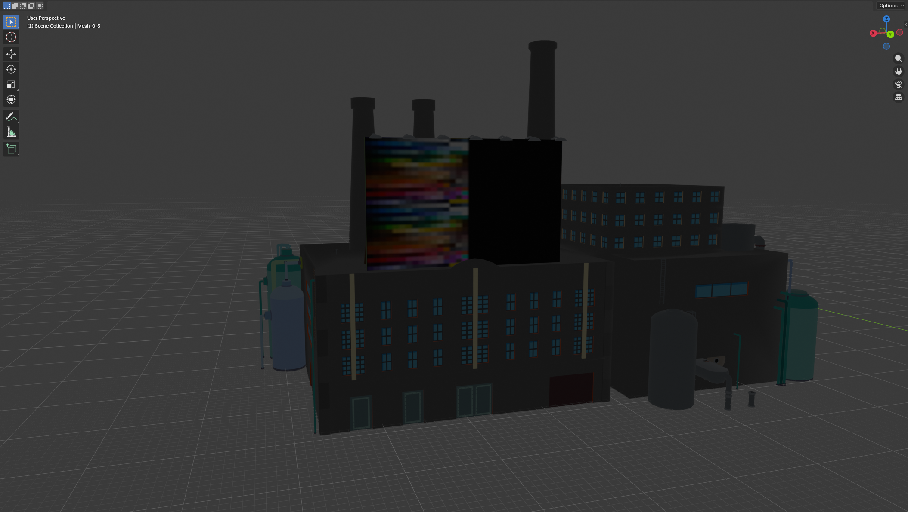
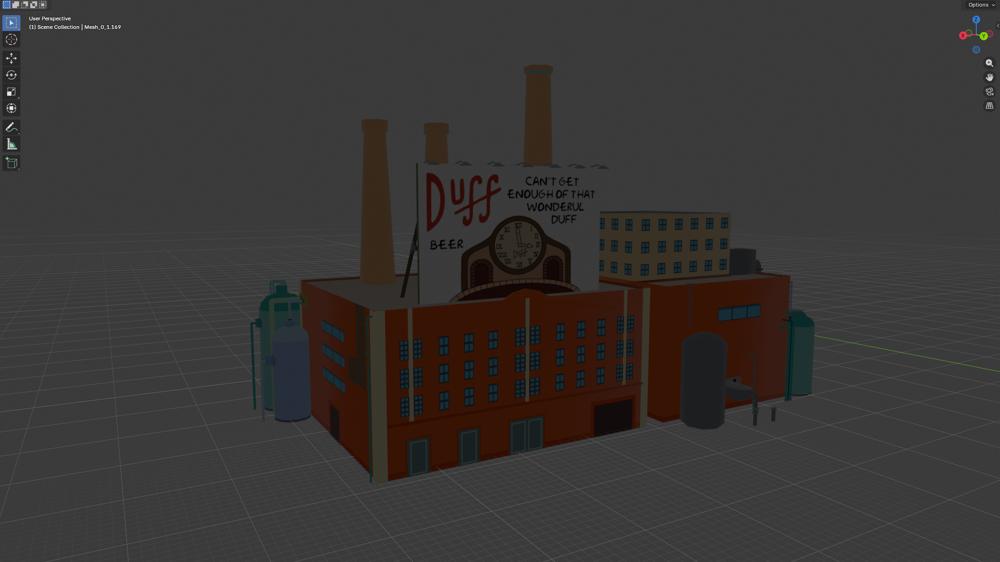

# Remake Engine Game Module: The Simpsons Game (2007, PS3 Edition)


This module re-implements *The Simpsons Game* (2007, PS3 edition) using the [RemakeEngine](https://github.com/yggdrasil-au/RemakeEngine). It converts user-provided assets into formats compatible with the [Godot Engine](https://godotengine.org/) and generates a playable project. **You must own an original copy of the game to use this module.**


## What is This?
This project is a highly automated reverse-engineering toolset and engine remake for *The Simpsons Game (PS3)*.

Rather than distributing copyrighted assets, the `RemakeEngine` automates the process of taking a user's legally dumped PS3 game, extracting the original assets, converting them into standard formats, and assembling them into a playable Godot project. The engine focuses on format conversion, data normalization, and rebuild scripts so contributors can reproduce the game from their own legally obtained files.

Godot provides the runtime (rendering, physics and scripting). This module concentrates on the hard work: parsing proprietary formats, converting game assets (models, textures, audio, video), and rebuilding scene data and mappings so a playable project can be generated automatically.

## Current Status & Known Issues
The module is in active development (Beta). Highlights and known problems:

- **Textures & Models:** Texture extraction completes reliably, and most models extract correctly. Texture-to-submesh mapping is currently unreliable on complex, high-LOD meshes — the importer falls back to texture name heuristics and may assign textures unpredictably (but repeatably). Low-LOD models are more likely to receive correct texture assignments.
- **Audio:** Localized dialogue (~14,698 files) and ~128 ambient clips convert and map successfully using `reversing/docs/PS3_GAME/USRDIR/A1_Audio/AudioMap.yaml`.
- **Music (.MUS):** The 17 music `.mus` archives can now be unpacked into paired `.snr` and `.sns` files with `operations/mus.bms`, and the resulting `.snr` files decode correctly in vgmstream as EA-XAS music streams.
- **Video:** VP6 and other video formats convert successfully with the toolchain.

Screenshots showing current extraction results (high-LOD texture issues vs. low-LOD working textures) appear further below in this document.

If you want to reproduce the current extraction pipeline or help debug mapping, see the `operations/` scripts and the format docs in `reversing/docs`.

## Help Wanted!
This is a large reverse-engineering effort and contributions are welcome. Areas where help would be most valuable:

1. **Texture Mapping:** Investigate how the original formats assign textures to submeshes and implement a reliable mapping strategy for high-LOD models.
2. **Format Documentation:** Expand and improve the format analyses in the docs repo (`reversing/docs/FormatAnalysis`).
3. **Blender / Import Pipelines:** Improve Blender automation scripts for robust material assignment and layer handling.

To contribute, open issues or PRs, or jump into the format docs and submit patches. If you want to discuss complex reverse-engineering tasks first, open an issue describing your approach and refer to the relevant `operations/` or `reversing/` files.

## Features

- Converts your legally obtained game assets into Godot-ready formats.
- Generates a Godot project using Python and GDScript.
- Requires possession of the original PlayStation 3 game.

## Goals

- Re-implement the original game logic in GDScript and C#.

## Module Platform Support

- **Current Support:** Windows only
- **Planned Support:** it should theoretically work on Linux and MacOS, but only ever tested on Windows. The engine is cross-platform, but some tools (Blender, QuickBMS, FFmpeg, vgmstream) may be platform-specific.

## Depends On
This module depends on the RemakeEngine, its managed toolchain, and the documentation repo checked out at `reversing/docs` inside this module root.
Tools such as Blender, QuickBMS, Godot, FFmpeg, and vgmstream are declared in `Tools.toml` and are downloaded and managed by RemakeEngine as needed.

## How To Use

This module is intended to be downloaded and executed through the RemakeEngine TUI, CLI or GUI.

> **TUI terminal note:** While an operation is running, do not resize or move the terminal window. RemakeEngine is still in development, and changing the terminal during active output can corrupt or break the TUI display.

### 1. Clone and launch the engine

```pwsh
git clone https://github.com/yggdrasil-au/RemakeEngine.git
cd RemakeEngine
dotnet build RemakeEngine.slnx -c Debug
dotnet run -c Release --framework net10.0 --project EngineNet
```

### 2. Download the game module from the registry

In the TUI, select `gitDownload` from the main game list:

```text
Select a game:
  demo  [registered, installed, unbuilt]
  ---------------
> gitDownload
  Exit
```

Then choose `Download from Registry`:

```text
--- Operations for: gitDownload
? Select an operation: (Use arrow keys)
> Download from Registry
  Download from Git URL
  ---------------
  Change Game
  Exit
```

Select module `2`, `TheSimpsonsGame-PS3`:

```text
Select module from registry:
1. demo (Disabled)
2. TheSimpsonsGame-PS3
3. TheSimpsonsGame-PS2
4. SimpsonsHitAndRun
5. TheSimpsonsRoadRage-PS2
```

Expected output:

```text
Select module from registry:
1. demo (Disabled)
2. TheSimpsonsGame-PS3
3. TheSimpsonsGame-PS2
4. SimpsonsHitAndRun
5. TheSimpsonsRoadRage-PS2
Selection # > 2
Running: Download from Registry

>>> Engine operation: Download from Registry
Downloading 'TheSimpsonsGame-PS3' from 'https://github.com/Superposition28/TheSimpsonsGame-PS3.git'...
Target directory: 'A:\TSG-test\RemakeEngine\EngineApps\Games\TheSimpsonsGame-PS3'
Cloning into 'A:\TSG-test\RemakeEngine\EngineApps\Games\TheSimpsonsGame-PS3'...
Submodule 'TheSimpsonsGame-PS3-Docs' (https://github.com/Superposition28/TheSimpsonsGame-PS3-Docs.git) registered for path 'reversing/docs'
Submodule 'TheSimpsonsGame-PS3-FileViewer' (https://github.com/Superposition28/TheSimpsonsGame-PS3-FileViewer.git) registered for path 'reversing/fileviewer'
Cloning into 'A:/TSG-test/RemakeEngine/EngineApps/Games/TheSimpsonsGame-PS3/reversing/docs'...
Cloning into 'A:/TSG-test/RemakeEngine/EngineApps/Games/TheSimpsonsGame-PS3/reversing/fileviewer'...
Submodule path 'reversing/docs': checked out '8fa61d72af3db0a89883b848e34d50c723c8f131'
Submodule path 'reversing/fileviewer': checked out 'bf256e8dc25924aca21af731639e94c403ae78cd'

Successfully downloaded 'TheSimpsonsGame-PS3'.
Completed successfully. Time: 14.7s.
Press any key to continue...
```

After the download completes, choose `Change Game` to return to the main menu. You should then see `TheSimpsonsGame-PS3` in the list:

```text
Select a game:
  demo  [registered, installed, unbuilt]
> TheSimpsonsGame-PS3  [registered, installed, unbuilt]
  ---------------
  gitDownload
  Exit
```

### 3. Select the module and answer the initialization prompts

When you select `TheSimpsonsGame-PS3`, the engine runs the module initialization step and asks for your game region and the path to your dumped game files.

The source path you enter should point at the game root folder that contains `USRDIR`. For example:

```text
Running 1 initialization operation(s) for TheSimpsonsGame-PS3

▶ Starting script: init.lua
Config not found. Creating: A:\TSG-test\RemakeEngine\EngineApps\Games\TheSimpsonsGame-PS3\config.toml
Created config.toml with default placeholders.
Reading module config: A:\TSG-test\RemakeEngine\EngineApps\Games\TheSimpsonsGame-PS3\config.toml
Initialized placeholders.num = "1"
Initialized placeholders.audio_state = "audio_none"
Initialized placeholders.Type = "Full"
No valid Region set in config.toml. You'll be prompted to set one (US, EU, or Both).
? Enter the game region (US, EU, or Both) and press Enter (leave blank to cancel):
EU
Set Region to 'EU'.

No MainSourcePath set in config.toml. You'll be prompted to set one.
? Enter the path to your game root (this folder should contain a folder named USRDIR) and press Enter (leave blank to cancel):
A:\RemakeEngine\Main\EngineApps\Games\TheSimpsonsGame-PS3\Source\EU\PS3_GAME
Checking path: 'A:\RemakeEngine\Main\EngineApps\Games\TheSimpsonsGame-PS3\Source\EU\PS3_GAME'
? Permission requested: Allow this script to access external path '"A:\RemakeEngine\Main\EngineApps\Games\TheSimpsonsGame-PS3\Source\EU\PS3_GAME"'? [Y/n]
y
Detected USRDIR under provided path; using 'A:\RemakeEngine\Main\EngineApps\Games\TheSimpsonsGame-PS3\Source\EU\PS3_GAME\USRDIR' as source root.
Will copy folder: 'PS3_GAME'

--- Source Path Handling ---
Validated source path (EU): 'A:\RemakeEngine\Main\EngineApps\Games\TheSimpsonsGame-PS3\Source\EU\PS3_GAME\USRDIR'
Local project data path: 'A:\TSG-test\RemakeEngine\EngineApps\Games\TheSimpsonsGame-PS3\Source\EU'
? Choose how to use the source files:
1) Copy folder 'PS3_GAME' into local 'EU' (Recommended, Safe)
2) Move folder 'PS3_GAME' into local 'EU' (Warning: Deletes originals)
3) Use original path 'PS3_GAME' directly (Warning: Tools may modify original files)

Enter your choice (1, 2, or 3):
1
...
══════════════════════════════════════════════════════════════════════════════════════════════════════════════════════════════════════════════════════════════════════════════════════════════════════════════════════════════════════════════════════════════════════════════Copying 30190 files... [====================>                                       ] 35% 10549/30190 (ok=10549, skip=0, err=0)
Active: none

Copy complete.
  Updating config.toml with effective Source Path...
  Config updated.

Validating final source location: 'A:\TSG-test\RemakeEngine\EngineApps\Games\TheSimpsonsGame-PS3\Source\EU\PS3_GAME\USRDIR'
All 23 required 'USRDIR_DIRS_ORIGINAL' subdirectories found in 'A:\TSG-test\RemakeEngine\EngineApps\Games\TheSimpsonsGame-PS3\Source\EU\PS3_GAME\USRDIR'.
Success: Source validated and saved: A:\TSG-test\RemakeEngine\EngineApps\Games\TheSimpsonsGame-PS3\Source\EU\PS3_GAME\USRDIR
◀ Finished script: Unnamed
Initialization completed successfully. Time: 40.5s. Press any key to continue...
```

Once initialization completes, the module operations menu becomes available.

### 4. Run the pipeline

After initialization, the operations menu looks like this:

```text
--- Operations for: TheSimpsonsGame-PS3
? Select an operation: (Use arrow keys)
> Run All
  ---------------
  Download Required Tools
  Extract Archives (.STR)
  Copy Source Audio/Video Files
  Extract Textures (.txd -> .png)
  Rename base folders
  Reorganize Audio Files
  Normalize folder structure
  Convert Models (.preinstanced -> .blend)
  Extract Dialogue/Subtitles (.lh2 -> .csv)
  Convert Audio (.snu -> .wav)
  Convert Videos (.vp6 -> .ogv)
  generate Godot Game (EXPERIMENTAL)
  ---------------
  Change Game
  Exit
```

For a full pipeline run, select `Run All`. If you are debugging a specific step, you can execute the operations individually from this menu, most will require all previous steps to have been completed first.

### 5. What the pipeline produces

- Extracted and normalized game data under `GameFiles/`
- Converted textures, audio, video, and model outputs
- Blender `.blend` files for `.preinstanced` assets
- CSV exports for `.lh2` dialogue/subtitle files
- An experimental generated Godot project via `generate Godot Game (EXPERIMENTAL)`


## File Breakdown

- `config/`
  - `config/RenameMap.db` - Maps original folder names to human-readable names used by the module.

- `GameFiles/` - Generated extraction, normalization, and conversion outputs created by the pipeline.

- `Godot/`
  - `Core/` - Reusable Godot project template kept in source control.
    - `addons/` - Third-party and custom Godot addons.
    - `Scripts/` - Scene builder and shared Godot scripts.
      - `import-V*.gd` - Main scene builder script.
    - `Json/**/*.json` - Asset locations and node/script mapping.
    - `project.godot` - Persistent Godot project settings template.
  - `GodotGame/` - Generated Godot project outputs, such as `Godot/GodotGame/SimpsonsGamePS3/`.
  - `godot-init-V*.lua` - Godot project bootstrap script.

- `operations/` - Core operation scripts (Lua, BMS, Blender, etc.).
  - `Blender/` - Blender conversion scripts and handlers.
  - `DirectoryNormalizer/` - Folder normalization logic and helpers.
  - `init/` - Initialization helpers used during config/bootstrap.
- `reversing/` - Reverse engineering utilities and the docs submodule.
  - `docs/` - Reverse engineering documentation repo submodule and generated docs site files.
  - `data/`, `fileviewer/`, `TSGFileViewer/` - Supporting reverse-engineering utilities and data.

- `Source/` - Local copy of user-provided game files (if copied/moved).
- `.gitignore` - Ignore rules for assets and outputs.
- `blank.blend` - Blank Blender file for model conversion.
- `config.toml` - Module-local configuration (stores `SourcePath`).
- `operations.toml` - Defines the sequence of asset-processing operations.
- `Readme.md` - This file.
- `Tools.toml` - Configuration for external tools managed by RemakeEngine.

### Path Placeholders

RemakeEngine operations use built-in placeholders for paths and configuration. These are provided by the engine, initialized by `operations/init.lua`, and updated by follow-up config steps defined in `operations.toml`.

**Built-in placeholders for `operations.toml`:**
- `{{Game_Root}}` — Path to this module's root directory.
- `{{Project_Root}}` — Path to the RemakeEngine root project directory.

**Key custom placeholders defined in `config.toml`:**
- `{{SourcePath}}` — Path to your original game dump root (set by `operations/init.lua` and stored in `config.toml`).
- `{{PostSourcePath}}` — Subpath appended under `{{SourcePath}}` when the pipeline targets the game data root (currently `PS3_GAME/USRDIR`).
- `{{Region}}` — Game region, e.g. `US` or `EU`.
- `{{Type}}` — Extraction/structure type for validation. Set to `FullFlattened` after normalization.
- `{{audio_state}}` — Audio layout state; set to `audio_reorg` after running the audio setup step.
- `{{isRenamed}}` — Flag indicating base folder rename status; set to `isRenamed` after the rename step.
- `{{STROUT}}` — Output root for extracted STR content; updated to `STROUT_Normalized` after normalization.

**Usage:**
- Placeholders are referenced in TOML and scripts as `{{PlaceholderName}}`.
- They are resolved by the engine before running each operation.
- Example: `args = ["{{SourcePath}}", "--map-db-file", "{{Game_Root}}/config/RenameMap.db"]`
- The current pipeline uses these placeholders to build the active `GameFiles/`, tool, and generated Godot project paths.

**Note:** The placeholder format is always double curly braces, e.g. `{{SourcePath}}`.

This module is fully automated and designed to be executed by [The Remake Engine](https://github.com/yggdrasil-au/RemakeEngine). All direct dependencies (Godot, Blender, QuickBMS, FFmpeg, vgmstream, etc.) are defined by `Tools.toml` and handled by RemakeEngine. **This module is in beta.**

### Operations Overview
- Init and config: `operations/init.lua` creates or updates `config.toml` and ensures the required placeholders exist.
- Download required tools: engine `download-tools` reads `Tools.toml`.
- Extract archives: `operations/simpsons_str.bms` extracts `.str` archives into `GameFiles/`.
- Copy source audio/video: `operations/CopySourceAudioVideo.lua` copies source media into the working `GameFiles/` tree.
- Extract textures: engine `format-extract` converts `.txd` textures into `.png` outputs.
- Rename base folders: engine `rename-folders` uses `config/RenameMap.db` and sets `isRenamed`.
- Reorganize audio: `operations/SetupAudioDir.lua` sets `audio_state`, applies `Dialogue` and `EN-CUTSCENE` folder rename rules from `reversing/docs/PS3_GAME/USRDIR/A1_Audio/AudioMap.yaml` across `EN/ES/FR/IT`, applies `Global-Sound` folder rename rules inside `A1_Audio/Global`, supports nested destination folders like `Enemies/Bosses`, and places mapped dialogue voice-line files inside `NEW_DIR_NAME/<CharacterName>/` while moving unmatched files to the `NEW_DIR_NAME` root.
- Normalize folder structure: `operations/DirectoryNormalizer/run.lua` normalizes the extracted tree and sets `Type=FullFlattened`.
- Convert models: `operations/Blender/run.lua` converts `.preinstanced` assets into `.blend` files, with optional `glb` and `fbx` export.
- Extract dialogue/subtitles: `operations/lh2_to_csv.lua` converts `.lh2` files to `.csv`.
- Convert audio/video: engine `format-convert` converts `.snu` to `.wav` and `.vp6` to `.ogv`.
- Generate Godot project: `Godot/godot-init-V0.5.2.lua` builds the generated Godot project (experimental).

---

## Reverse Engineering & Format Documentation

For technical details and reverse-engineering notes on the file formats used in The Simpsons Game (PS3), see:

- [reversing/docs/readme.md](./reversing/docs/readme.md) -- Overview of the in-module documentation repo layout.
- [reversing/docs/FormatAnalysis/index.html](./reversing/docs/FormatAnalysis/index.html) -- Landing page for format-specific analyses, including audio, RenderWare assets, and miscellaneous formats.
- [reversing/docs/PS3_GAME/index.html](./reversing/docs/PS3_GAME/index.html) -- Disc layout documentation and links into `USRDIR` content.

These resources provide:

- Format breakdowns for `.snu`, `.mus`, `.str`, `.vp6`, and more.
- Links to detailed reverse-engineering notes for each format.
- Game-specific file layout documentation for `PS3_GAME/USRDIR`.
- Guidance for contributing new format analyses or deduplicating documentation.

---

## Obligatory Legal Disclaimer

This project automates extraction of assets (3D models, sounds, videos) from *The Simpsons Game* 2007 (PS3 edition) for personal use only--hobby projects, learning, research, etc.--not for commercial distribution.

**Key Points:**

- **Requires Ownership of the Game:** You must possess your own legally obtained ISO copy of the game for PlayStation 3. This tool does not provide game files.
- **Respect Copyright:** Extracted assets are copyrighted by Electronic Arts (EA) and Disney. Use is limited to personal exploration and modification of assets from a game you legally own. You are responsible for compliance with copyright laws and the game's EULA/Terms of Service where applicable.
- **No Distribution of Assets:** This project does not distribute copyrighted game assets. It only provides code to automate extraction from your own files and should not be used to share or distribute game content.

**By using this project, you acknowledge that you have read and understood this disclaimer and agree to use it responsibly and in accordance with all applicable laws and terms of service.**

---
---

GameFiles\EU-FullFlattened-audio_reorg-isRenamed\LHub-00_SprHub\sprHub\zone08str\assets\environs\sprIndustrialBldgDuffBreweryGeo\exportBldgDuffBrewery\
High LOD model with broken textures

low LOD model with working textures


gotta love that, especially since the textures are applied mostly randomly, but repeatably it will always be the same random texture applied to the same model.
i assume low lod models have less layers and less overall textures so my script is more likely to apply the correct textures to the low lod models?

---
---


---
Extract Archives (.STR)


---


---
---

