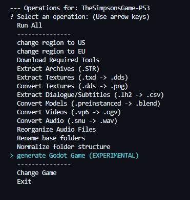
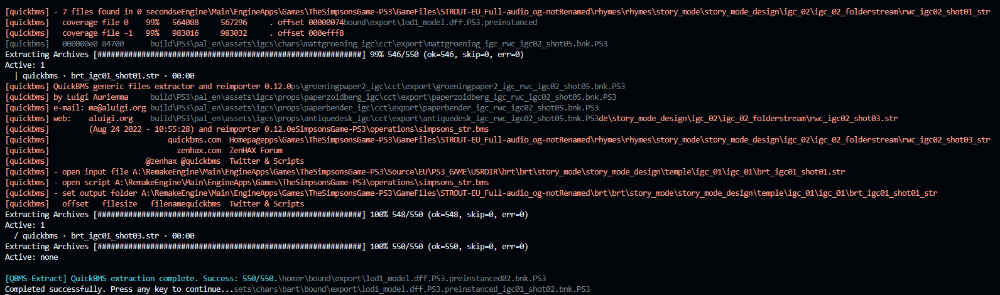
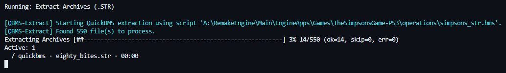
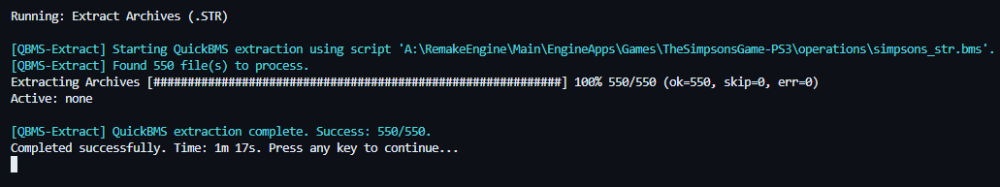

# Remake Engine Game Module: The Simpsons Game (2007, PS3 Edition)

This module re-implements *The Simpsons Game* (2007, PS3 edition) using the [RemakeEngine](https://github.com/yggdrasil-au/RemakeEngine). It converts user-provided assets into formats compatible with the [Godot Engine](https://godotengine.org/) and generates a playable project. **You must own an original copy of the game to use this module.**

## Features

- Converts your legally obtained game assets into Godot-ready formats.
- Generates a Godot project using Python and GDScript.
- Requires possession of the original PlayStation 3 game.

## Goals

- Re-implement the original game logic in GDScript and C#.

## File Breakdown

- `config/`
  - `config/RenameMap.db` - Maps original folder names to human-readable names used by the module.

- `Godot/`
  - `Game/` - Godot project files and scripts for remake logic.
    - `addons/` - Third-party and custom Godot addons.
    - `rootfiles/Scripts/` - Scene Builder GDScript for generating game nodes and worlds.
      - `import-V*.gd` - Main scene builder script.
    - `godot-init-V*.lua` - Godot project initializer.
    - `rootfiles/json/**.json` - Asset locations and node/script mapping.

- `operations/` - Core operation scripts (Lua, BMS, Blender, etc.).
  - `Blender/` - Blender conversion scripts and handlers.
- `reversing/` - Reverse engineering notes and format analyses.
  - `Source/` - Main format documentation and notes.
  - `Source/Format-Analysis/` - Detailed format-specific analyses.

- `Source/` - Local copy of user-provided game files (if copied/moved).
- `.gitignore` - Ignore rules for assets and outputs.
- `blank.blend` - Blank Blender file for model conversion.
- `config.toml` - Module-local configuration (stores `SourcePath`).
- `operations_cli.md` - CLI documentation for operations.
- `operations.toml` / `operations.json` - Defines the sequence of asset-processing operations.
- `Readme.md` - This file.
- `Tools.toml` / `Tools.json` - Configuration for external tools managed by RemakeEngine.

### Path Placeholders

RemakeEngine operations use built-in placeholders for paths and configuration. These are provided by the engine and some are set by the module's `init.lua` or changed after successful operations using `config.lua` and resolved automatically in `operations.toml` for scripts.

**Built-in placeholders for `operations.toml`:**
- `{{Game_Root}}` — Path to this module's root directory.
- `{{Project_Root}}` — Path to the RemakeEngine root project directory.

**Custom placeholders defined in `config.toml`:**
- `{{SourcePath}}` — Path to your validated original game files (set by `init.lua` and stored in `config.toml`).
- `{{Region}}` — Game region, e.g. `US` or `EU`.
- `{{Type}}` — Extraction/structure type for validation. Set to `FullFlattened` after normalization.
- `{{audio_state}}` — Audio layout state; set to `audio_reorg` after running the audio setup step.
- `{{isRenamed}}` — Flag indicating base folder rename status; set to `isRenamed` after the rename step.
- `{{STROUT}}` — Output root for extracted STR content; updated to `STROUT_Normalized` after normalization.

**Usage:**
- Placeholders are referenced in TOML and scripts as `{{PlaceholderName}}`.
- They are resolved by the engine before running each operation.
- Example: `args = ["{{SourcePath}}", "--map-db-file", "{{Game_Root}}/config/RenameMap.db"]`
- The validation operations select the correct index DB based on `Region`, `Type`, `audio_state`, and `isRenamed`.

**Note:** The placeholder format is always double curly braces, e.g. `{{SourcePath}}`.

This module is fully automated and designed to be executed by [The Remake Engine](https://github.com/yggdrasil-au/RemakeEngine). All direct dependencies (Godot, Blender, QuickBMS, etc.) are defined by `Tools.toml`/`Tools.json` and handled by RemakeEngine. **This module is in beta.**

### Operations Overview
- Init and config: creates/updates `config.toml`, ensures placeholders exist.
- Validate source: engine `validate-files` using `config/GameFilesIndex_{...}.db`.
- Download required tools: engine `download-tools` reading `Tools.toml`.
- Rename base folders: engine `rename-folders` using `config/RenameMap.db` (sets `isRenamed`).
- Reorganize audio: `operations/SetupAudioDir.lua` (sets `audio_state`, applies `EN-Dialogue` and `EN-CUTSCENE` folder rename rules from `reversing/docs/PS3_GAME/USRDIR/A1_Audio/AudioMap.yaml` across `EN/ES/FR/IT`, applies `Global-Sound` folder rename rules inside `A1_Audio/Global`, and prefixes mapped dialogue voice-line filenames with character names when known).
- Normalize folder structure: `operations/DirectoryNormalizer.lua` using `config/DirectoryNormalizer.rules.json` (sets `Type=FullFlattened` and updates `STROUT` to `STROUT_Normalized`).
- Extract/convert: STR extract, TXD -> DDS, DDS -> PNG, with optional video/audio conversions.
- Blender conversion: converts `.preinstanced` → `.blend` (and optionally `glb`/`fbx`), using the main index DB.
- Final validation and Godot project generation (experimental).

---

## Reverse Engineering & Format Documentation

For technical details and reverse-engineering notes on the file formats used in The Simpsons Game (PS3), see:

- [reversing/Source/README.md](./reversing/Source/README.md) -- Overview of main formats in USRDIR and STR output.
- [reversing/Source/Format-Analysis/README.md](./reversing/Source/Format-Analysis/README.md) -- Index of all format-specific analyses, including audio, RenderWare assets, and miscellaneous formats.

These resources provide:

- Format breakdowns for `.snu`, `.mus`, `.str`, `.vp6`, and more.
- Links to detailed reverse-engineering notes for each format.
- Guidance for contributing new format analyses or deduplicating documentation.

---

## Obligatory Legal Disclaimer

This project automates extraction of assets (3D models, sounds, videos) from *The Simpsons Game* 2007 (PS3 edition) for personal use only--hobby projects, learning, research, etc.--not for commercial distribution.

**Key Points:**

- **Requires Ownership of the Game:** You must possess your own legally obtained ISO copy of the game for PlayStation 3. This tool does not provide game files.
- **Respect Copyright:** Extracted assets are copyrighted by Electronic Arts (EA) and Disney. Use is limited to personal exploration and modification of assets from a game you legally own. You are responsible for compliance with copyright laws and the game's EULA/Terms of Service where applicable.
- **No Distribution of Assets:** This project does not distribute copyrighted game assets. It only provides code to automate extraction from your own files and should not be used to share or distribute game content.

**By using this project, you acknowledge that you have read and understood this disclaimer and agree to use it responsibly and in accordance with all applicable laws and terms of service.**

---
---

---
Extract Archives (.STR)

---

---

